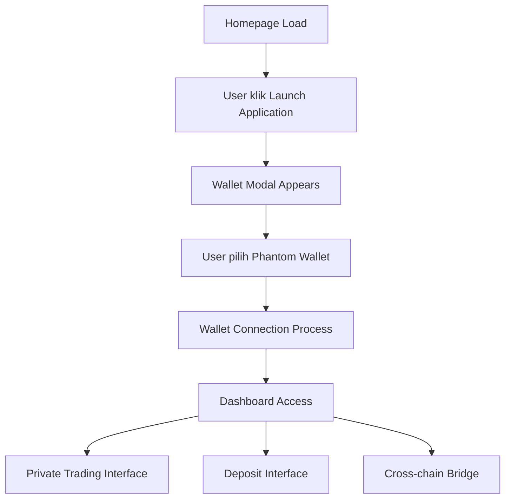

# Dokumentasi Elemen Interaktif Erebus Protocol

## Daftar Lengkap Elemen Interaktif

### Navigation Elements
| Index | Type | Text | URL/Href | Fungsi |
|-------|------|------|----------|---------|
| [3] | Link | HOME | https://erebusprotocol.com/#home | Navigasi ke section home |
| [4] | Link | FEATURES | https://erebusprotocol.com/#features | Navigasi ke section features |
| [5] | Button | ROADMAP | - | Menampilkan roadmap project |
| [6] | Button | DOCS | - | Mengakses dokumentasi |
| [7] | Button | WHITEPAPER | - | Mengakses whitepaper project |
| [8] | Link | GITHUB | https://github.com/erebus-protocol/erebus-privacy | Link eksternal ke repository GitHub |

### Call-to-Action Elements
| Index | Type | Text | Fungsi |
|-------|------|------|---------|
| [9] | Button | Learn More | Scroll ke section informasi lebih detail |
| [10] | Button | Select Wallet | Membuka modal koneksi wallet |
| [13] | Button | Launch Application | Memulai aplikasi dashboard (memerlukan wallet) |

### Wallet Control Elements
| Index | Type | Text | Fungsi |
|-------|------|------|---------|
| [11] | UL | Change wallet | Container untuk kontrol change wallet |
| [12] | LI | Change wallet | List item untuk change wallet |
| [19] | Button | Phantom | Pilihan wallet Phantom di modal |

### Social Media & External Links
| Index | Type | URL | Fungsi |
|-------|------|-----|---------|
| [15] | Link | https://twitter.com/erebusprotocol | Link ke Twitter resmi |
| [16] | Link | https://github.com/erebus-protocol/erebus-privacy | Link ke GitHub repository |

### Images & Media
| Index | Type | Fungsi |
|-------|------|---------|
| [1] | Img | Ikon logo Erebus |
| [2] | Img | Teks logo "EREBUS" |
| [14] | Img | Icon tambahan (di footer) |
| [15] | Img | Icon social media |

## Status Elements berdasarkan State Halaman

### State 1: Homepage (Default)
- **Elements Active**: [0-17] (navigation, CTA buttons, social links)
- **Elements Hidden**: [18-20] (modal elements)

### State 2: Modal Wallet Connection
- **Elements Active**: [18-20] (modal buttons, close, Phantom option)
- **Elements Hidden**: Modal overlay di atas content utama

### State 3: After Phantom Selection
- **Behavior**: Modal disappears, return ke homepage dengan state berbeda
- **Status**: Wallet connection initiated but not completed

## Flow Interaksi User

## Responsive Design Elements

### Desktop Layout
- Header dengan navigation horizontal
- Hero section dengan CTA buttons prominent
- Footer dengan social links

### Mobile Considerations
- Navigation kemungkinan collapse ke hamburger menu
- CTA buttons scale appropriately
- Modal designed untuk mobile interaction

## Accessibility Features

### Keyboard Navigation
- Tab order melalui interactive elements
- Modal dapat ditutup dengan ESC
- Button focus states implemented

### Visual Indicators
- Golden/yellow color scheme untuk high contrast
- Clear button labeling
- Icon + text combinations untuk clarity

## Security Considerations

### Wallet Integration
- Modal-based wallet connection
- No direct wallet access without user action
- Phantom wallet integration standard

### JavaScript Dependency
- App requires JavaScript untuk full functionality
- Clear messaging tentang requirement
- Fallback handling di place

## Performance Observations

### Loading Behavior
- Page loads quickly dengan minimal dependencies
- Modal appears instantly after button click
- No visible loading states during interaction

### Asset Optimization
- Images properly sized
- Minimal external dependencies
- Clean code structure

## Browser Compatibility

### Tested Elements
- Interactive buttons respond properly
- Modal functionality works correctly
- Navigation links functional
- External links open appropriately

### Potential Issues
- JavaScript requirement untuk full functionality
- Wallet connection depends on browser wallet extensions
- Modal may have different behavior di berbagai browser

## Future Enhancement Opportunities

### Dashboard Expansion
- Real-time transaction monitoring
- Advanced privacy controls
- Portfolio analytics
- Cross-chain bridge status

### User Experience Improvements
- Loading states untuk wallet connection
- Error handling untuk failed connections
- Progressive disclosure untuk complex features

### Integration Possibilities
- Additional wallet support
- Mobile app companion
- API for third-party integrations