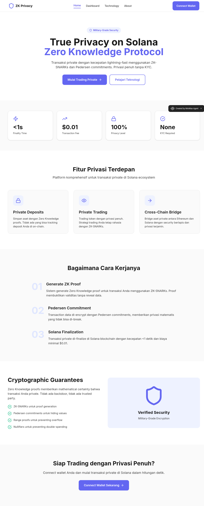

# EREBUS ZK PRIVACY PLATFORM - UI/UX ANALYSIS REPORT

## Executive Summary
Comprehensive UI/UX analysis of the Erebus ZK Privacy Platform (https://4fnmivsytmq1.space.minimax.io) covering design elements, functionality testing, and gap analysis against konekt.market design patterns.

## 1. FULL LANDING PAGE SCREENSHOT

## 2. FUNCTIONALITY & NAVIGATION TESTING

### Successfully Tested Features:
- ✅ **Home Page** - Landing page dengan hero section
- ✅ **Dashboard** - Wallet connection interface
- ✅ **Technology** - ZK-SNARKs technical information
- ✅ **About** - Development roadmap dan platform info
- ✅ **Connect Wallet** - Integration dengan Phantom, Solflare
- ✅ **CTA Buttons** - "Mulai Trading Private" & "Pelajari Teknologi"
- ✅ **Navigation Flow** - Intuitive dan consistent

### Technical Infrastructure:
- **Blockchain**: Solana Devnet
- **Wallets**: Phantom, Solflare, compatible Solana wallets
- **Technology**: ZK-SNARKs, Pedersen commitments
- **Performance**: <1s finality, $0.01 transaction fees

## 3. CURRENT DESIGN ELEMENTS ANALYSIS

### Color Scheme:
- **Primary Background**: Soft purple/pink gradient (#f8f4ff)
- **Text Colors**: Dark gray/black untuk readability
- **Accent Color**: Deep purple (#6366f1 style) untuk CTAs
- **Supporting Colors**: Light grays untuk subtle elements
- **Consistency**: Purple theme throughout all interactive elements

### Typography:
- **Font Family**: Modern sans-serif (Inter/System style)
- **Hierarchy**: Clear H1, H2, body text distinction
- **Language**: Mixed Indonesian/English content
- **Readability**: Good contrast dan spacing

### Layout Structure:
- **Navigation**: Top header dengan logo, menu, CTA
- **Hero Section**: Centered content dengan strong hierarchy
- **Content Organization**: Single-column, scannable layout
- **Footer**: Minimal dengan attribution

### Visual Hierarchy:
1. **Primary**: Hero headline "True Privacy on Solana"
2. **Secondary**: CTA buttons untuk action
3. **Tertiary**: Supporting content dan navigation

### Interactive Elements:
- **Navigation**: Purple hover states
- **CTAs**: Solid purple buttons dengan clear affordance
- **Connect Wallet**: Prominent placement
- **Trust Badges**: "Military-Grade Security" credibility

## 4. RESPONSIVE DESIGN STATUS
Platform demonstrates potential responsive structure but requires comprehensive testing across various viewport sizes for optimal mobile experience.

## 5. BRAND IDENTITY & CONVERSION FLOW

### Brand Identity:
- **Logo**: Shield icon emphasizing security
- **Messaging**: "ZK Privacy" - zero-knowledge focused
- **Trust Signals**: Military-grade security, No KYC
- **Technical Credibility**: Strong ZK-SNARKs explanation

### Conversion Flow:
1. **Landing** → Clear value proposition
2. **Education** → "Pelajari Teknologi" path
3. **Action** → "Mulai Trading Private" conversion
4. **Wallet Connection** → Platform access requirement

## 6. TECHNICAL FEATURES ANALYSIS

### Core Functionality:
- **ZK-SNARKs**: Zero-knowledge proof system
- **Pedersen Commitments**: Transaction privacy encryption
- **Cross-chain**: Ethereum-Solana bridge capability
- **Privacy**: 100% mathematical certainty
- **Performance**: Lightning-fast finality <1s

### Current User Journey:
- Landing page dengan value proposition
- Technical education via Technology page
- Wallet connection untuk platform access
- Basic dashboard untuk transaction management

## 7. GAP ANALYSIS vs KONEKT.MARKET PATTERNS

### STRENGTHS TO MAINTAIN:
1. **Clear Privacy Focus** - Highly targeted messaging
2. **Technical Credibility** - Strong ZK-SNARKs foundation
3. **Wallet Integration** - Clean connection flow
4. **Security Messaging** - Effective trust signals
5. **Performance Metrics** - Specific technical advantages

### AREAS FOR IMPROVEMENT:

#### Visual Sophistication:
- **Current**: Flat design, minimal visual depth
- **Needed**: Enhanced shadows, gradients, micro-interactions
- **Priority**: High

#### Color System:
- **Current**: Basic purple palette
- **Needed**: Multi-tone system dengan variations
- **Priority**: Medium

#### Data Visualization:
- **Current**: Text-heavy technical content
- **Needed**: Interactive charts, process diagrams
- **Priority**: Medium

#### Dashboard Enhancement:
- **Current**: Basic wallet connection screen
- **Needed**: Rich analytics, transaction history
- **Priority**: High

#### Mobile Optimization:
- **Current**: Desktop-focused layout
- **Needed**: Comprehensive mobile experience
- **Priority**: High

#### Content Interactivity:
- **Current**: Static informational pages
- **Needed**: Interactive demos, calculators
- **Priority**: Medium

## 8. TECHNICAL IMPLEMENTATION FEASIBILITY

### IMMEDIATE (Week 1-2):
- CSS shadows dan gradient enhancements
- Hover state improvements
- Mobile responsive optimization

### SHORT-TERM (Month 1):
- Data visualization implementation
- Enhanced dashboard features
- Interactive content elements

### LONG-TERM (Months 2-3):
- Comprehensive analytics dashboard
- Progressive Web App features
- Advanced UI component library

## 9. DESIGN SYSTEM MODIFICATIONS

### Required Components:
1. **Extended Color Palette** - Multi-tone purple spectrum
2. **Typography Scale** - More granular sizing options
3. **Component Library** - Standardized buttons, cards
4. **Spacing System** - Consistent grid implementation
5. **Interactive States** - Defined hover/active/disabled

### Implementation Priorities:
1. **Visual Depth** - Shadows, elevation, animations
2. **Responsive Design** - Mobile-first approach
3. **Interactive Elements** - Better user engagement
4. **Data Presentation** - Charts dan visualizations
5. **Content Enhancement** - Interactive demos

## 10. RECOMMENDATIONS

### Priority 1 (Immediate):
- Add visual depth dengan CSS shadows
- Implement better mobile responsive design
- Enhance hover states dan micro-interactions

### Priority 2 (Short-term):
- Create data visualization untuk ZK processes
- Develop rich analytics dashboard
- Add interactive educational tools

### Priority 3 (Long-term):
- Comprehensive design system implementation
- Advanced Web3 integrations
- Performance optimization

## CONCLUSION

The Erebus ZK Privacy Platform has excellent technical foundation dengan clear privacy-focused messaging dan strong cryptographic credibility. The primary opportunities lie dalam enhancing visual sophistication, mobile experience, dan interactive elements to match modern Web3 platform standards while maintaining the strong technical messaging yang sudah ada.

The platform successfully communicates complex ZK concepts dan maintains consistent branding, providing a solid base untuk scaling menjadi a comprehensive DeFi privacy platform dengan enterprise-grade UI/UX experience.